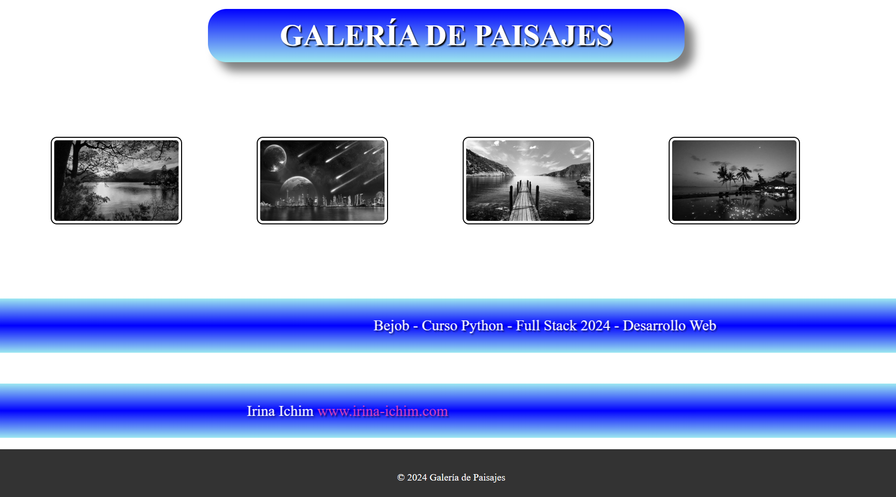

# Galería de Imágenes y Plantilla HTML/CSS Simple



Este proyecto es una simple plantilla creada únicamente con HTML y CSS como parte del curso "Bejob - Curso Python - Full Stack 2024 - Desarrollo Web", específicamente en el capítulo de fundamentos de desarrollo web.

## Descripción

La plantilla es una galería de imágenes básica que muestra una colección de paisajes. Utiliza HTML para la estructura y CSS para los estilos. Incluye un carrousel con efecto de escala de grises y zoom al pasar el mouse, así como banners con animaciones y un footer simple.

## Características

- Galería de imágenes con efecto de escala de grises y zoom al pasar el mouse.
- Banners con animaciones de movimiento.
- Footer simple al final de la página.

## Instalación

No se requiere instalación. Simplemente clona el repositorio y abre el archivo `index.html` en tu navegador web.

```bash
git clone https://github.com/Irina-Ichim/Bejob-SimpleGaleriaImagenes.git
```

## Uso

Una vez que hayas clonado el repositorio, abre el archivo index.html en tu navegador para ver la plantilla de galería de imágenes.
